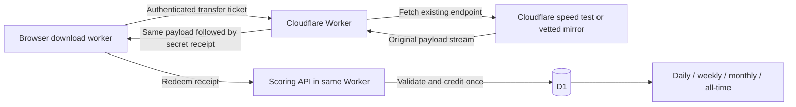

**Data: accounts, trustworthy leaderboards, and deployment**

Research date: 28 September 2026. Repository inspected: `TotoB12/data`, commit `48652e989cd9f1932dba4bd5e5e6b5cf5b37a35e`.

Status at the time of research: architecture research, source inspection, and a small offline counter reproduction. The follow-up implementation is described in [the README](../README.md). No Cloudflare deployment or production usage benchmark has been performed. Pricing and platform capabilities below were checked against official sources during research; performance targets are recommendations, not verified production results.

Implementation follow-up, 1 October 2026: [the low-usage implementation plan](implementation-plan.md) sets the proposed request flow, sparse cumulative scoring, quota review thresholds, benchmark gates, and later PR sequence. It supersedes the per-transfer request/ledger examples below; no relay performance or quota claim has been established yet.

**Latest constraint: preserve the sources and minimize account quota usage**

The owner already has Workers Paid, but the target is roughly one or two backend requests per normal visit/run, not one request per downloaded chunk. The per-transfer HTTP relay described later is a protocol baseline, not the preferred transport under this budget. No relay has been implemented or benchmarked yet.

The most relevant prototype is **one continuous HTTP download stream plus one ordinary-Worker control WebSocket** for an already authenticated run. The Worker fetches successive or concurrent chunks from the existing sources inside that stream; authenticated checkpoints follow their payload, and acknowledgments return over the existing socket. There is no new incoming Worker request for each upstream chunk or receipt. Static assets should bypass application execution. This retains the original sources, requires no buckets, and can share the account/scoring Worker.

Cloudflare bills the WebSocket upgrade as one Worker request, not each subsequent message. Upstream fetch subrequests are not separately charged as Worker requests. This is specific to ordinary Workers; adding a Durable Object introduces different request/duration billing. [Worker billing](https://developers.cloudflare.com/workers/platform/pricing/).

Two connections are a **target for an uninterrupted signed-in run**, not a hard whole-visitor guarantee: OTP send/verify, reconnections, renewed streams, reloads, and any extra parallel data lanes add requests. A single binary WebSocket could combine everything into one request, but requires explicit bounded flow control and its own throughput validation. Ordinary browser WebSockets do not provide automatic backpressure. [Browser WebSocket behavior](https://developer.mozilla.org/en-US/docs/Web/API/WebSocket).

Few incoming requests do not mean negligible resource use. Every relayed byte still passes through the Worker; CPU and D1 operations remain metered. Accumulated CPU and subrequest limits can force long streams to restart. Runtime updates and network changes can also end them. [Worker limits](https://developers.cloudflare.com/workers/platform/limits/).

For scale, 1,000 stable sessions per day over 30 days at two connections each means 60,000 incoming run requests, excluding the extra operations above. This arithmetic estimates request count only, not total account consumption. The go/no-go measurements must include CPU per GiB, D1 writes per session, reconnection frequency, and throughput versus the existing direct path. Do not call this low-cost merely because it uses two request entries.

Keep checkpoint acknowledgment separate from storage frequency: small acknowledgments can arrive on the socket while durable scoring is coalesced into bounded intervals. Any optimization from per-transfer ledger rows to authenticated cumulative checkpoints needs atomic maximum-offset updates, stable stream identities, fixed replay deadlines, and period-aware accounting. It must not simply add a cumulative total on each message. Saving only when the tab closes is unreliable; periodic durable checkpoints trade small database usage for bounded progress loss.

If the constraint instead means **only two brief API calls and no ongoing backend work**, keep all downloads direct and submit a start/final report. That meets the small-backend goal but cannot independently verify byte totals with the interfaces found. Signed tickets, server elapsed time and duplicate rejection mitigate some abuse; plausible invented totals remain possible. Do not silently replace the requested verification with this weaker model.

Recommendation: evaluate the two-connection relay before choosing any full implementation. It is the promising way to reconcile the request-count target with stronger verification, but minimal overall quota usage and unchanged throughput are not established. The remaining sections detail the shared receipt/auth/scoring mechanism and deployment requirements; the one-request-per-chunk variant is not the selected deployment plan.

**Keeping the existing sources**

Keep Cloudflare's speed-test endpoint and the existing vetted mirrors as the download sources. Add a streaming relay route to the same Cloudflare Worker that serves accounts and scoring. The relay fetches those sources, forwards the payload without storing a file, and appends a one-use completion receipt that the backend validates before awarding bytes. The supporting stack remains Static Assets, D1, Better Auth email OTP, Cloudflare Email Service, and Turnstile.

This needs no dedicated server, buckets, stored payload files, or replacement data generator. It does add a managed backend route, and every ranked payload byte crosses that route. It preserves the data source, but changes the network path from browser-to-source to browser-to-Worker-to-source. A relay must not be promised to match current throughput before measurement. Keep the direct mode available as unranked if needed.

Cloudflare explicitly documents forwarding upstream response streams and adding a suffix while the body streams. This supports the mechanism, not the performance or service availability of this particular application. [Workers Streams API](https://developers.cloudflare.com/workers/runtime-apis/streams/).

The code, database migrations, configuration, and setup automation can all live in this repository. Runtime accounts, totals, and secrets live in TotoB12's Cloudflare account. A plain static-page publication cannot create a secure shared backend by itself. The achievable experience is **one initial account/domain setup, then automatic deployment from the repository**.

**What the current repository actually does**

The repository is a static HTML/CSS/JavaScript app. There is no backend, database, package manifest, Wrangler configuration, or account system. `script.js:40` creates a browser Web Worker from `flood-worker.js`; that is a thread inside the user's browser, not a Cloudflare Worker.

`flood-worker.js:74` registers Cloudflare's `https://speed.cloudflare.com/__down` and six Hetzner sources. Its adaptive loops fetch directly from these services. At `flood-worker.js:328`, `downloadChunk()` reads each response, then prefers the advertised `Content-Length` over its locally accumulated body length. At `flood-worker.js:463`, it adds the result to in-memory counters. No trusted server observes those increments.

Two counting edge cases were reproduced by executing the existing function in a Node VM with a mocked response and no network requests:

| Mocked response | Body actually read | Current recorded amount |
| --- | ---: | ---: |
| Content-Length 100; running flag becomes false after first read | 40 bytes | 100 network bytes; 40 logical bytes |
| Content-Length 100; reader throws AbortError after first read | 40 bytes | 0 network bytes; 0 logical bytes |

These tests establish the function's behavior, not how frequently either timing occurs in a real browser. They show why partial downloads need explicit accounting before reusing the local counter. Counting at chunk completion also makes the displayed speed bursty. The displayed GB/MB values use powers of 1024 internally; use GiB/MiB labels or switch to decimal units consistently.

The current UI's “Verified data transfer” and “network layer” wording overstates what it measures. Content-Length describes a representation, and fetch body reads can be decoded. Neither is a mobile carrier's billable byte counter, nor does either include all transport overhead and retransmissions. Define the new ranked metric as **accepted completed payload bytes**, with an exact, published unit convention. Keep partial local progress separate from accepted leaderboard totals.

**Why a backend cannot just trust this counter**

Someone controls their browser and can replace the JavaScript, edit its counters, or call the submission API directly. Email login proves access to a mailbox. A signed start ticket proves permission to start. Neither proves that a reported 500 GB was downloaded.

Heartbeats, increasing sequence numbers, server timestamps, one active run, plausible speed ceilings, Turnstile, and anomaly review can reject replays and obvious abuse. They cannot distinguish a real download from an attacker submitting believable increments for an hour. Signing a client-supplied total on the server only authenticates the server's acceptance of that claim. Obfuscation, WebAssembly, a browser Web Worker, or a secret shipped with the frontend do not change the trust boundary.

Cloudflare's public speed-test implementation contains a relevant nuance: `LoggingBandwidthEngine` extracts an opaque token from the end of some downloads and can submit it to a logging endpoint. A bounded 1,024-byte request made during this research returned a `___` separator and a 64-character hexadecimal token at the end. The token's format alone does not establish its cryptographic algorithm. The library's default measurement logging endpoint is null, and its logging code does not expose a verification result to an integrator. The README also documents experimental customer-authorization settings. These are not a documented third-party verification contract for Data accounts. No supported public verifier, verification key, or account-bound receipt interface was found in the official material reviewed. [Logging engine](https://github.com/cloudflare/speedtest/blob/main/src/engines/BandwidthEngine/LoggingBandwidthEngine.ts), [default configuration](https://github.com/cloudflare/speedtest/blob/main/src/config/defaultConfig.ts), [integration README](https://github.com/cloudflare/speedtest/blob/main/README.md).

This is an evidence limitation, not a claim that Cloudflare could never offer such an integration. A supported provider integration with independently verifiable, user-bound receipts could preserve the direct path. It requires confirmation from Cloudflare before becoming an implementation dependency.

**Comparison of realistic approaches**

| Approach | Preserves current direct path | Resistance to fake byte totals | Main tradeoff |
| --- | --- | --- | --- |
| Browser totals plus backend checks | Yes | Low to moderate; believable fabricated totals still pass | Good only for explicitly self-reported competition |
| Public Cloudflare download-tail token | Potentially | Not established for our backend | No supported external verification contract found |
| Worker proxy plus our own completion receipt | No; adds our endpoint | Stronger against simple fabrication/replay | Retains upstream dependency; benchmark and confirm intended service use |
| Worker-generated stream plus completion receipt | No; uses our Cloudflare endpoint | Stronger against simple fabrication/replay | Generation, streaming CPU, and throughput must be measured |
| Own origin/R2 fixture plus Worker verification | No | Similar receipt trust model | Extra resource management; unnecessary initially |

Under the clarified requirement, I recommend the streaming-relay option. The generated-source and own-origin options above are alternatives, not the implementation plan. Start with a bounded relay performance prototype before investing in the full ranked UI. If preserving the direct browser-to-source connection as well as the source is non-negotiable, there is no verified solution using the existing ordinary fetches and the reviewed public Cloudflare interfaces: use a clearly self-reported board or obtain a supported provider integration. Passing through our server only to obtain a URL or HTTP redirect does not allow it to meter the subsequent direct download.

Small random spot checks can establish that some traffic occurred; they cannot authenticate the entire amount reported between checks. Neither a hash of predictable test bytes nor browser PerformanceResourceTiming is independent evidence. Cryptographic TLS-witness systems are a different possible architecture, but require an instrumented client and a verifier, rather than retroactively authenticating existing fetches. They would need their own infrastructure and throughput evaluation. [TLSNotary's architecture and browser requirements](https://tlsnotary.org/docs/faq/).

Cloudflare explains that its own Network Quality API runs on Workers. The managed edge platform is therefore relevant to this workload, although that does not prove our JavaScript implementation will match its performance. Its public speed test uses a finite measurement methodology; a continuous data-consumption game should not assume an unlimited upstream service commitment. [Cloudflare's speed-test architecture](https://blog.cloudflare.com/how-does-cloudflares-speed-test-really-work/).

**Proposed ranked-download protocol**

The following is our proposed application protocol, not a Cloudflare attestation feature:

1. The user logs in. The backend creates a short-lived ranked run using server-owned identity and timestamps, then grants a bounded number of transfer tickets. Tickets authorize a server-selected payload size, an immutable hard transfer deadline, and a latest redemption deadline. They expire quickly and are not completion receipts.
2. The browser's existing download worker requests the controlled transfer endpoint with a valid ticket and a source identifier. The backend resolves that identifier to an allowlisted existing source. For example, initial experiments can compare 16, 32, and 64 MiB transfers and several concurrency settings. These are benchmark candidates, not fixed production requirements.
3. The Cloudflare Worker fetches the existing source and forwards its payload using bounded buffers and backpressure. It counts actual response-body bytes, validates the expected upstream status/length, and aborts on failure or an invalid size. Only the final bytes of a successfully relayed response contain an unpredictable, authenticated receipt bound to the user, run, unique transfer ID, validated byte count, server receipt-issuance timestamp, and the ticket's fixed redemption deadline. The receipt must never appear in response headers, grant responses, logs, or another metadata endpoint.
4. The browser retains the receipt after consuming the response. It submits receipts to the same-origin scoring API, individually or in small batches. The server validates their authenticity and identity binding; it ignores any client-proposed byte count.
5. D1 records each unique transfer once and updates its period totals atomically. Repeating the request or retrying redemption returns the previous result without awarding the bytes again.



The reason to place the receipt at the end is practical: for normal HTTP clients on the controlled HTTPS streaming path, obtaining it requires traversing the preceding response body. This is possession evidence, not a cryptographic measurement of every physical byte delivered. Merely incrementing a server counter when bytes are generated, read from an upstream, or enqueued does not establish that the client received the download. An ordinary client “done” message provides no additional trust.

The protocol must reject Range and HEAD shortcuts, conditional responses and alternate small-body paths. It must disable caching and content compression/transformation for transfers, including under non-browser Accept-Encoding values. Use binary responses, no-store/no-transform, and verify the actual deployed headers and wire size; do not assume a large decoded body implies equally large traffic. Cloudflare documents compression control and Worker response behavior. [Compression](https://developers.cloudflare.com/speed/optimization/content/compression/), [Worker Response API](https://developers.cloudflare.com/workers/runtime-apis/response/).

Receipt signing keys stay in runtime secrets. Validate ticket ownership, expiry, allowed sizes and methods on the backend. Use distinct ticket/receipt purposes or keys so an authorization token cannot be redeemed as a completion token. Bound the number of outstanding tickets and the size of redemption batches. If a ticket is reused for another download attempt, its transfer identity must still permit only one credit. Every attempt shares the original grant's immutable deadlines: terminate overdue streams, do not extend redemption on retries, and retain deduplication through the latest possible redemption plus a safety interval. Otherwise a delayed duplicate stream could mint a fresh receipt after the first credit's deduplication row was deleted.

A first version should award only completed transfers. Interrupted bytes still appear in the local counter but are not ranked. If this loses too much progress, introduce smaller, disjoint frames with their own receipts. Never repeatedly add cumulative offsets: either credit each unique frame once or atomically advance a maximum acknowledged offset.

For the recommended relay, read only an allowlisted upstream and never forward user cookies or arbitrary destinations. Reject redirects or revalidate each destination instead of following user-controlled redirects. Browser Range requests must not expose a receipt shortcut; separately, the server may construct a validated upstream Range for an existing Hetzner file. Propagate downstream cancellation upstream and bound the transfer lifetime. Issue a receipt for bytes actually streamed under the controlled response framing, not simply for the requested upstream size. Receiving 100 MB at the Worker alone is not grounds to award 100 MB to the browser.

Request uncompressed upstream content and validate its encoding. Rebuild downstream headers deliberately: appending a receipt changes the response length, so do not blindly reuse upstream Content-Length, Content-Encoding, ETag, Content-Range or Set-Cookie. A counted TransformStream plus a small receipt suffix needs only bounded working memory. Database writes occur on receipt redemption, not for every stream buffer. This all fits within the existing account/scoring Worker deployment; no separate server fleet is required. [Worker fetch behavior](https://developers.cloudflare.com/workers/runtime-apis/fetch/), [Worker response behavior](https://developers.cloudflare.com/workers/runtime-apis/response/).

**What this protects, and what it cannot prove**

| Attempt | Expected outcome |
| --- | --- |
| Change a local counter or submit arbitrary JSON | No valid receipt; no credit |
| Change the receipt's byte count or user | Authentication fails |
| Redeem one receipt repeatedly or concurrently | One ledger entry and one credit |
| Stop early, then claim the full transfer | No final receipt; no full credit |
| Request only the last bytes | Rejected; must not expose the receipt through Range/HEAD |
| Download on a cloud VM or another device | Can still obtain genuine receipts |
| Share one account or own multiple email addresses | Remains possible; needs product rules rather than byte verification |

The proposed system makes casual fake-score submissions substantially harder. It does not prove that the traffic crossed the person's phone, used mobile rather than Wi-Fi, appeared on a carrier invoice, or came from one unique human. Even a dedicated server would not establish those facts on its own. Phrase the board as account-associated completed downloads. A one-active-run rule is a reasonable initial competition rule, but it is distinct from byte authenticity.

**Application and authentication architecture**

Keep the vanilla frontend and its off-main-thread download loops. Serve static files and `/api/*` from one Worker and origin. Static routing can bypass application execution while the API routes invoke the Worker. Pages Functions could support D1/auth too, but a Worker with assets is simpler if streaming or Durable Objects are added. Pages cannot deploy a Durable Object class by itself. [Worker asset routing](https://developers.cloudflare.com/workers/static-assets/routing/worker-script/), [Pages bindings](https://developers.cloudflare.com/pages/functions/bindings/).

Use Better Auth's email-OTP plugin and native D1 support. It is a library inside our deployment, so it does not require an external hosted authentication account. Generate and check its database schema into migrations; pin and test a maintained patched version. Native D1 support is documented by the maintainers. [D1 support](https://better-auth.com/blog/1-5#cloudflare-d1-support).

The sign-in flow is email, emailed code, then a cookie session; the same flow can create an account. Configure a short expiry, limited attempts, atomic one-time use, and keyed-hash OTP storage with a separate runtime secret. A bare fast hash of a six-digit code is cheap to enumerate after a database leak. The documented OTP storage default is plaintext, so this needs an explicit setting. Never log codes. [Email OTP](https://better-auth.com/docs/plugins/email-otp).

Use persistent rate-limit storage, per-email resend cooldowns, per-IP throttles and a global email budget. Default in-memory limiting is insufficient across edge isolates. Wrappers that call Better Auth through `auth.api` must enforce their own limits because those calls bypass its client-route limiter. Protect the OTP-send route explicitly with Turnstile: the library's captcha defaults cover other routes and should not be assumed to cover email OTP. Preserve Secure, HttpOnly, host-only cookie sessions and origin/CSRF checks. [Rate limiting](https://better-auth.com/docs/concepts/rate-limit), [captcha configuration](https://better-auth.com/docs/plugins/captcha), [session security](https://better-auth.com/docs/reference/security).

Cloudflare Email Service now supports outbound transactional mail to arbitrary recipients on Workers Paid. Older advice that Cloudflare can only mail pre-verified account addresses is incomplete. Email Sending is currently Beta and requires onboarding a domain using Cloudflare DNS. It can connect directly through a Worker binding. Verify the account's initial sending quota and delivery to common mailbox providers before launch. [Email Service](https://developers.cloudflare.com/email-service/), [sender onboarding](https://developers.cloudflare.com/email-service/get-started/send-emails/), [limits](https://developers.cloudflare.com/email-service/platform/limits/).

Resend is a sensible interchangeable fallback if the email beta or its account eligibility is unsuitable. It adds an external provider and secret, and still requires an owned, verified sending domain. Its current free tier is 3,000 emails/month with a 100/day limit. Hosted auth such as Clerk is possible, but adds a service without solving the traffic-verification problem. [Resend pricing](https://resend.com/pricing), [Resend domains](https://resend.com/docs/dashboard/domains/introduction), [Clerk authentication options](https://clerk.com/docs/guides/configure/auth-strategies/sign-up-sign-in-options).

**Leaderboard storage and period rules**

Use D1 for the library's auth tables plus public profiles, ranked runs, accepted transfer events, and period totals. Avoid storing authoritative counters in eventually consistent caches. An optional per-user Durable Object can later coordinate strict leases or abuse budgets; it is not needed for a small initial D1-based implementation. Keep bulk downloads outside that object.

| Table | Purpose |
| --- | --- |
| Auth tables | Users, sessions, verification records and shared throttles |
| `profiles` | Public alias, visibility and moderation state; no public email |
| `runs` | Server-owned user, start/expiry, active lease, status |
| `score_events` | Unique transfer ID, user/run, accepted bytes, server timestamps, receipt expiry |
| `period_totals` | `(period_kind, period_start, user_id)` and integer byte total |

Use a unique insertion plus an AFTER INSERT aggregate trigger, or a strict unique insert and transaction batch that rolls back on conflict. The ledger entry and all its totals must succeed together. `INSERT OR IGNORE` followed by unconditional increments is wrong: duplicate receipts would still increase the totals. D1 documents transactional batch rollback. [D1 batch semantics](https://developers.cloudflare.com/d1/worker-api/d1-database/#batch).

Proposed defaults: day starts 00:00 UTC; week starts Monday 00:00 UTC; month is the calendar month; all-time begins at launch. Show the next reset time in the viewer's local time. These are product defaults, not requirements inferred from the existing code.

Attribute a credited chunk to its authenticated `receipt_issued_at`, the server time when the Worker emits its tail, with a short bounded redemption grace period. This is not a timestamp of the device finishing reception. Do not use the browser clock or redemption time to let users shift old receipts into a later competition. Label periods as provisional until all eligible receipts' fixed deadlines pass. A chunk spanning midnight belongs wholly to the receipt-issuance period; smaller frames improve granularity if needed.

Changing period keys naturally starts new leaderboards; there is no need to zero counters with a reset job. Use integer bytes and handle database values without lossy JavaScript integer conversion as totals grow. Index period/rank queries and use deterministic tie ordering. Cache only public leaderboard responses briefly, and keep the signed-in user's pending/accepted progress explicit.

Receipt batches reduce API round trips, but each unique credited transfer still needs durable deduplication. Do not claim batching alone eliminates ledger writes. Retain deduplication evidence through the grant's immutable latest redemption deadline plus a safety interval, covering every retry, not just the first receipt observed; compact old detail only after preserving aggregates. Keep email, session tokens, receipts and detailed IP history out of public APIs and routine logs. Provide account deletion and bounded diagnostic retention.

**How much can be automatically provisioned?**

| Resource or step | Repository-driven setup | Owner prerequisite |
| --- | --- | --- |
| Frontend and Worker | Yes | Authorize deployment to the correct account |
| D1 database and schema | Yes, provisioning plus versioned SQL migrations | Permissions to create/access D1 |
| Optional Durable Object | Yes, declared class/binding | Applicable account entitlement |
| Runtime secrets | Names and secure initialization can be scripted | Authorize secret creation; never commit values |
| Turnstile widget | API bootstrap possible; not a standard Deploy-button resource | Correct hostname and Turnstile permissions |
| Email sender configuration | API bootstrap possible for eligible domains | Owned Cloudflare DNS domain and paid entitlement |
| Domain ownership, billing, account access | Cannot be manufactured by repository code | TotoB12 supplies/authorizes these once |

The official Deploy to Cloudflare button provisions D1 and Durable Objects, discovers secret names, and accepts package build/deploy scripts. It is a template-install flow that clones into the deploying user's Git account and updates resource configuration. It is useful for distributing Data to other owners. For TotoB12's existing repository, connect Workers Builds and use an idempotent bootstrap/deploy script. [Deploy button](https://developers.cloudflare.com/workers/platform/deploy-buttons/).

Wrangler can automatically provision a missing D1 binding during deployment. However, a brand-new ordinary CLI/Git deployment must ensure the database exists before running remote migrations. Do not assume copying a migration-first script from the template-button workflow solves that ordering. Ordinary dashboard builds do not currently persist generated IDs back into Git in the same way as the button workflow. Resolve and preserve the intended database identity; never create a fresh database on every push. [Automatic provisioning](https://developers.cloudflare.com/workers/wrangler/configuration/#automatic-provisioning).

The owner's deploy script should: verify the account, resolve/create named resources idempotently, initialize missing runtime secrets securely, apply checked-in migrations, deploy, then run a small health/schema check. Preserve existing secret values unless explicitly rotating them. A second deployment must preserve accounts and scores. Keep preview databases separate from production. Ensure build credentials have D1 access: the documented default Workers Builds token permissions should not be assumed to cover every resource-management or migration operation. Runtime secrets and build secrets are separate. [Build configuration](https://developers.cloudflare.com/workers/ci-cd/builds/configuration/), [D1 migrations](https://developers.cloudflare.com/workers/wrangler/commands/d1/#d1-migrations-apply).

Turnstile creation can be scripted with its management API. Sender setup can also be partially automated through Cloudflare's Email Sending API when the account/domain are eligible. Neither removes account permissions, domain ownership, or DNS readiness. [Turnstile API setup](https://developers.cloudflare.com/turnstile/get-started/widget-management/api/), [Email sender API](https://developers.cloudflare.com/api/resources/email_sending/subresources/subdomains/methods/create/).

Suggested eventual repository shape:

```text
public/                         current page, styles, scripts, fonts and icon
src/worker.ts                   same-origin API and routing
src/auth.ts                     OTP library and email adapter
src/transfers.ts                streaming, grants and completion receipts
src/scoring.ts                  receipt validation and leaderboard queries
migrations/                     auth and scoring schema/indexes
scripts/bootstrap.mjs           idempotent owner-account setup
scripts/deploy.mjs              migrations, deployment and health check
tests/                          protocol, scoring, auth and deployment checks
wrangler.jsonc                  assets, bindings, variables and limits
package.json + lockfile         pinned dependencies and commands
.dev.vars.example              secret names and safe placeholders only
README.md                       owner setup, scoring definition and deploy button
```

Only `public/` should be published as assets; serving the repository root risks exposing future source/configuration files. Commit configuration and migrations, never account tokens or a `.dev.vars` file containing real secrets. No framework rewrite is required.

**Costs and performance**

Workers Paid currently starts at $5/account/month, with 10 million requests and 30 million CPU milliseconds included; overage is $0.30/million requests and $0.02/million CPU milliseconds. Workers does not add a per-GB egress charge. This is not a promise that arbitrary traffic is free or that application CPU cost is negligible. [Workers pricing](https://developers.cloudflare.com/workers/platform/pricing/).

Cloudflare Email Sending includes 3,000 emails/account/month on that plan, then $0.35/1,000. Include domain costs if TotoB12 does not already have one. [Email pricing](https://developers.cloudflare.com/email-service/platform/pricing/).

D1 Paid currently includes 25 billion rows read and 50 million rows written per month, plus 5 GB stored data; storage overage is billed per GB-month. Its own overages apply. D1 Free has 100,000 written rows/day, so frequent ledger/aggregate/index writes can exhaust it. Count index maintenance in estimates. [D1 pricing](https://developers.cloudflare.com/d1/platform/pricing/).

Illustrative application arithmetic, not a bill prediction: 1 TiB delivered in 32 MiB completed transfers produces 32,768 transfers. A ledger row and four period updates produce at least 163,840 logical table-row writes, before indexes, auth and ticket bookkeeping. Batched redemption reduces request count but does not erase these rows. At a continuous 1 Gbit/s, roughly 108 decimal TB cross the connection in ten days; small per-transfer CPU costs can accumulate. Measure real CPU per GiB and database writes per accepted GiB.

HTTP Workers can stream while clients remain connected; there is no enforced response-size cap, but the isolate memory limit is 128 MB. Avoid loading a whole 100–768 MB response into memory. The free plan's 10 ms CPU budget makes a high-volume counted relay an unproven fit. Static assets have a 25 MiB per-file ceiling, but the relay needs no payload assets at all. [Worker limits](https://developers.cloudflare.com/workers/platform/limits/).

Do not route each payload buffer through D1 or a Durable Object. Keep database work at ticket/receipt boundaries, use bounded stream buffers, and benchmark concurrency rather than copying the current 72–96-loop ceiling. Auth and leaderboard UI must not run inside the hot download loop. Rate/CPU limits and an operational stop switch should bound mistakes in this intentionally high-volume application.

**Implementation gates**

1. Fix local partial-byte accounting and define local versus accepted totals. Preserve the fast download path and anonymous use.
2. Prototype a persistent HTTP data stream plus a control WebSocket relaying the existing Cloudflare speed-test source, with authenticated checkpoints. Check that upstream accepts Worker-originated fetches, then measure total incoming requests, CPU/GiB, D1 writes, reconnections, throughput against direct mode, abort behavior, compression, memory and concurrency on desktop and mobile. Validate each existing mirror separately before enabling ranked credit for it. A reasonable provisional target is at least 90% of direct-mode throughput on the same connection, but the owner must decide the acceptable tradeoff after measurements.
3. Test forged, altered, cross-account, duplicated and concurrently redeemed receipts; expired tickets; Range/HEAD; compressed responses; interrupted transfers; period boundaries and retry recovery. Verify that requesting only metadata never yields a usable completion receipt.
4. Add email OTP and public profiles, with retry/race/expiry/resend tests and real delivery checks to controlled test mailboxes.
5. Build the four leaderboards from accepted events and test reset boundaries, ties, late receipts and account privacy.
6. Rehearse installation in an empty authorized account/environment, then redeploy. Confirm resources are provisioned, migrations run once, secret values stay private, and existing scores survive. Only then claim the setup is one-click or one-command.

The current candidate is **keep the existing sources and use persistent connections for verification, rather than one incoming request per download chunk**. No buckets or replacement source are required. Low incoming request count is supported by the billing model; low overall quota usage and comparable throughput remain benchmark questions. If ongoing backend processing is excluded entirely, strong independent byte verification is not available through the reviewed interfaces.
